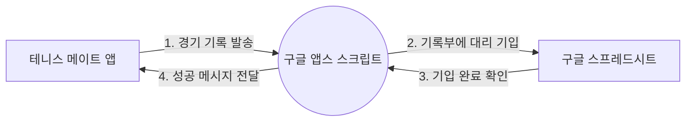

# ⚠️ DEPRECATED - 이 문서는 더 이상 사용되지 않습니다

> **새로운 가이드를 확인하세요!**
>
> 이 파일은 **GOOGLE_SHEETS_SETUP_GUIDE.md**로 통합되어 더 이상 업데이트되지 않습니다.
>
> 👉 **[새 설정 가이드 보기 (GOOGLE_SHEETS_SETUP_GUIDE.md)](./GOOGLE_SHEETS_SETUP_GUIDE.md)**
>
> 새 가이드는 다음을 포함합니다:
> - 더 자세한 단계별 설명
> - 스크린샷 지원
> - 개선된 FAQ 및 문제 해결
> - 초보자 친화적인 설명

---

## 1. 개요: 왜 구글 스프레드시트와 연결해야 할까요?

테니스 메이트는 기본적으로 사용자의 웹 브라우저에 데이터를 임시로 저장합니다. 하지만 브라우저의 캐시를 삭제하거나 기기를 변경할 경우, 소중한 경기 기록이 소멸될 위험이 있습니다.

구글 스프레드시트와 연동하면 다음과 같은 이점이 있습니다:

* **영구적 보관**: 구글의 안전한 서버에 기록이 실시간으로 저장됩니다.
* **데이터 활용**: 엑셀처럼 기록을 편집하거나 나중에 통계를 내기 용이합니다.
* **어디서나 확인**: 스마트폰이나 PC 등 어떤 기기에서도 동일한 데이터를 불러올 수 있습니다.

---

## 2. 작동 원리: '디지털 우체국' 시스템

테니스 메이트 앱은 보안상의 이유로 여러분의 구글 드라이브에 직접 접근할 권한이 없습니다. 이를 해결하기 위해 우리는 **구글 앱스 스크립트(Google Apps Script)**라는 '중개인'을 활용합니다.



* **앱(Tennis Mate)**: 편지를 쓰는 사람입니다.
* **스크립트(Script)**: 편지를 전달받아 스프레드시트라는 장부에 대신 적어주는 **디지털 우체국**입니다.
* **URL(웹 앱 주소)**: 이 우체국의 **전용 사서함 주소**와 같습니다.

---

## 3. 단계별 설정 가이드

### 제1단계: 구글 스프레드시트 준비 및 스크립트 입력

1. 기존에 사용하던 구글 시트를 열거나 새 시트를 생성합니다.
2. 상단 메뉴에서 **[확장 프로그램] > [Apps Script]**를 클릭합니다.
3. 기존에 있는 코드를 모두 지우고, 아래의 **최신 코드**를 복사하여 붙여넣습니다.

```javascript
/* Tennis Mate 최신 연동 코드 */
const COLS = {
  TIMESTAMP: 0, DATE: 1, DURATION: 2, WINNER1: 3, WINNER2: 4,
  LOSER1: 5, LOSER2: 6, SCORE: 7, WINNER_SCORE: 8, LOSER_SCORE: 9, LOCATION: 10
};

function doGet(e) {
  const sheet = SpreadsheetApp.getActiveSpreadsheet().getActiveSheet();
  const data = sheet.getDataRange().getValues();
  if (data.length > 1) data.shift(); 
  return ContentService.createTextOutput(JSON.stringify(data)).setMimeType(ContentService.MimeType.JSON);
}

function doPost(e) {
  const lock = LockService.getScriptLock();
  lock.tryLock(10000);
  try {
    const sheet = SpreadsheetApp.getActiveSpreadsheet().getActiveSheet();
    const params = JSON.parse(e.postData.contents);
    const newRow = [];
    newRow[COLS.TIMESTAMP] = new Date();
    newRow[COLS.DATE] = params.date || '';
    newRow[COLS.DURATION] = params.duration || 0;
    newRow[COLS.WINNER1] = params.winner1 || '';
    newRow[COLS.WINNER2] = params.winner2 || '';
    newRow[COLS.LOSER1] = params.loser1 || '';
    newRow[COLS.LOSER2] = params.loser2 || '';
    newRow[COLS.SCORE] = params.score || '';
    newRow[COLS.WINNER_SCORE] = params.winner_score || 0;
    newRow[COLS.LOSER_SCORE] = params.loser_score || 0;
    newRow[COLS.LOCATION] = params.location || '';
    sheet.appendRow(newRow);
    return ContentService.createTextOutput(JSON.stringify({status: 'success'})).setMimeType(ContentService.MimeType.JSON);
  } catch (e) {
    return ContentService.createTextOutput(JSON.stringify({status: 'error', message: e.toString()})).setMimeType(ContentService.MimeType.JSON);
  } finally { lock.releaseLock(); }
}

```

### 제2단계: 디지털 우체국 개설 (배포)

가장 중요한 단계입니다. 이 과정을 거쳐야 앱이 시트에 접근할 수 있습니다.

1. 오른쪽 상단 파란색 **[배포]** 버튼을 누르고 **[새 배포]**를 선택합니다.
2. 유형 선택(톱니바퀴 아이콘)에서 **[웹 앱]**을 선택합니다.
3. **설명**에 "테니스 메이트 연동"이라고 적습니다.
4. **액세스 권한이 있는 사용자**를 반드시 **[모든 사람(Anyone)]**으로 설정해야 합니다.
* *이유: '나'로 설정하면 테니스 메이트 앱이 외부인으로 간주되어 접근이 차단됩니다.*


5. 배포 버튼을 누르고, 화면에 나타나는 **웹 앱 URL**을 복사합니다.

### 제3단계: 테니스 메이트에 주소 등록

1. 테니스 메이트 앱의 **설정(Setup)** 메뉴로 이동합니다.
2. 복사한 **웹 앱 URL**을 입력창에 붙여넣습니다.
3. 연결 성공 메시지가 뜨면 모든 준비가 끝났습니다.

---

## 4. 자주 묻는 질문 및 문제 해결 (Troubleshooting)

### Q1. "연결 성공"이라는데 화면이 멈춰있어요.

새 시트를 연결했을 때 발생하는 현상입니다. 시트에 데이터가 하나도 없어서 앱이 무엇을 보여줄지 모르는 상태입니다.

* **해결책**: 앱 화면에 나타나는 **"새 세션 시작(Start New Session)"** 버튼을 누르세요. 샘플 선수 명단이 생성되며 정상 작동합니다.

### Q2. "Invalid response format" 오류가 발생합니다.

주로 스크립트 코드를 수정하고 나서 '저장'만 하고 '배포'를 새로 하지 않았을 때 발생합니다.

* **해결책**: 반드시 **[배포] > [새 배포]**를 통해 새로운 버전의 URL을 발급받아 앱에 등록해야 합니다.

### Q3. 기존에 쓰던 시트의 데이터를 지워야 하나요?

아니요, 그대로 두셔도 됩니다. 새로운 코드는 기존 데이터 아래에 새로운 칸(장소, 세부 점수 등)을 추가하여 기록을 이어 나갑니다.

---

**안내**: 본 매뉴얼은 기술적 표준(Standardization)과 데이터의 무결성(Validation)을 고려하여 작성되었습니다. 설정 과정에서 어려움이 있으시면 언제든 지원을 요청해 주시기 바랍니다.

기록된 데이터가 여러분의 테니스 실력 향상을 위한 소중한 자산이 되기를 바랍니다. 본 가이드와 관련하여 추가적인 자동화 기능이나 시각화 도구가 필요하신가요?