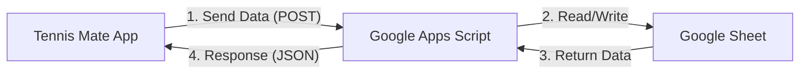

# How Tennis Mate Connects to Google Sheets

Here is a simple explanation of how the application talks to your Google Sheet behind the scenes.

## The Big Picture

Tennis Mate runs entirely in your browser (Client-side). It cannot talk directly to the Google Sheets file in your Google Drive because of security restrictions (CORS) and authentication complexity.

To solve this, we use **Google Apps Script** as a "Bridge" or "Middleman".



## Step-by-Step Connection

1.  **Deployment**: When you deploy the Apps Script as a "Web App", Google gives you a unique URL (starts with `https://script.google.com/...`). This URL acts like a public mailbox for your specific sheet.
2.  **Request**: When you click "Save" in Tennis Mate, the app bundles your data (players, matches) into a text packages (JSON) and sends it to that URL.
3.  **The Script**: The script sits on Google's servers. It receives the package, opens the spreadsheet it is attached to, and writes the data into the cells.
4.  **Response**: Once finished, the script sends a "Success" message back to Tennis Mate, and the app updates your screen.

## Why did it hang before?

Tennis Mate is designed to show the **Player List** only when there are players to show.
-   **The Problem**: When you connected a brand new Google Sheet, it was successfully connected, but it was empty (0 players).
-   **The Result**: The app said "Connection Successful" but didn't close the setup window because it was waiting for players to exist before showing the main screen.
-   **The Fix**: We added a feature to detect this "Empty Sheet" state and give you a button to **"Start New Session"**, which automatically creates default players (Nadal, Federer, etc.) so you can enter the app immediately.

### Troubleshooting
- **"Invalid response format" Error**:
  - This usually means you haven't deployed the script updates properly.
  - **Action**: Go to **Deploy > New deployment** (do NOT just save).
  - Ensure "Who has access" is set to **"Anyone"**.
  - Copy the *new* Web App URL and paste it into Tennis Mate.
- **Connection Failed**: Ensure "Who has access" is set to "Anyone". If set to "Only me", the app cannot access it.
- **CORS Error**: The script must return properly formatted JSON. Ensure you copied the code exactly.

### Can I use my existing Google Sheet?
**YES.** You do not need to create a new sheet.
1. Keeping your existing data is fine.
2. The new script will simply start adding new columns (Location, etc.) to new rows.
3. Old rows will remain valid.
4. Just update the **Apps Script Code** attached to that sheet and **Deploy New Version**.

## ⚠️ CRITICAL: Updated Google Apps Script

To support the new **Location** and **Split Score** features, you MUST replace your existing Google Apps Script with the code below.

### 1. Code.gs

Copy this entire block and paste it into your `Code.gs` file in the Apps Script editor.

```javascript
// Tennis Mate - Google Sheets Backend
function getOrCreateMatchesSheet() {
  const spreadsheet = SpreadsheetApp.getActiveSpreadsheet();
  let sheet = spreadsheet.getSheetByName('Matches');
  if (!sheet) {
    sheet = spreadsheet.insertSheet('Matches');
    sheet.appendRow(['timestamp', 'date', 'duration', 'winner1', 'winner2', 'loser1', 'loser2', 'score', 'winner_score', 'loser_score', 'location']);
  }
  return sheet;
}

function doGet(e) {
  const sheet = getOrCreateMatchesSheet();
  const data = sheet.getDataRange().getValues();
  const rows = data.slice(1);
  const recentRows = rows.slice(-100).reverse();
  return ContentService.createTextOutput(JSON.stringify(recentRows)).setMimeType(ContentService.MimeType.JSON);
}

function doPost(e) {
  const sheet = getOrCreateMatchesSheet();
  const params = JSON.parse(e.postData.contents);
  sheet.appendRow([
    new Date(),
    params.date,
    params.duration,
    params.winner1,
    params.winner2,
    params.loser1,
    params.loser2,
    params.score,
    params.winner_score,
    params.loser_score,
    params.location
  ]);
  return ContentService.createTextOutput(JSON.stringify({result: 'success'})).setMimeType(ContentService.MimeType.JSON);
}
```

### 2. Deployment Instructions (Important!)

1.  In the Apps Script Editor, click **Deploy** -> **New deployment**.
2.  Select **Type**: Web app.
3.  **Description**: "Added location and split scores".
4.  **Execute as**: `Me (your@email.com)`.
5.  **Who has access**: `Anyone`.
6.  Click **Deploy**.
7.  **Copy the newly generated URL**.
8.  Paste this new URL into Tennis Mate's **Reference Setup**.

> **Note**: Even if the URL looks the same, you MUST do "New deployment" for code changes to take effect!


